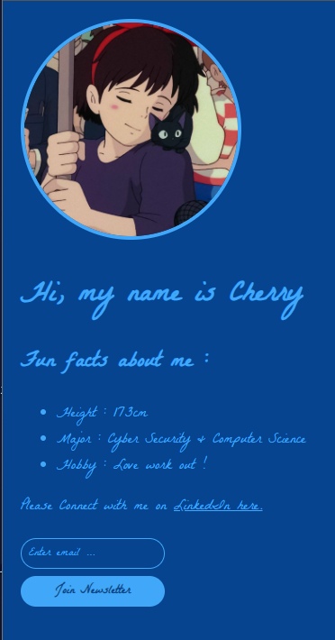

1. index.js
    - dynamically changes style with user preferences
2. index.html
    - main page
3. style.css
    - style 

How I deployed my simple project ?
1. Netlify
2. Deploy with GitHub (using console)
3. doesn't work ..! -> I will try to figure it out later
